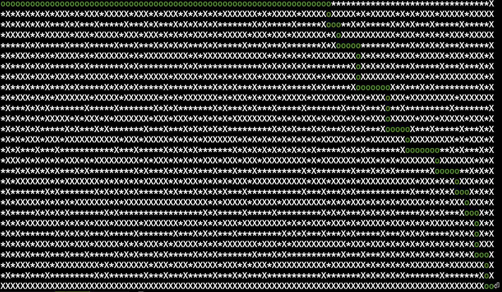

# Dante 

>The purpose of this project is to create a maze generator and solver.

<p align="center">
    
</p>

## Generator

For the generation we used the [_binary tree_](https://hurna.io/en/academy/algorithms/maze_generator/binary.html) algorithm.

<p align="center">
    
</p>

## Solver

For the solver we used the [_recursiv backtracting_](https://www.geeksforgeeks.org/rat-in-a-maze-backtracking-2/) algorithm.

<p align="center">
    
</p>

## Build and run

Linux:

```sh
make
./generator/generator x y [perfect]
./solver/solver maze.txt
```

## Contributors

- Clément Ruat  [![github-link][github-logo]](https://github.com/fantoruse)
- Antoine Desruet [![github-link][github-logo]](https://github.com/antwxne)

<!-- Markdown link & img definition's -->

[Github-logo]: https://img.shields.io/badge/GitHub-100000?style=for-the-badge&logo=github&logoColor=white
